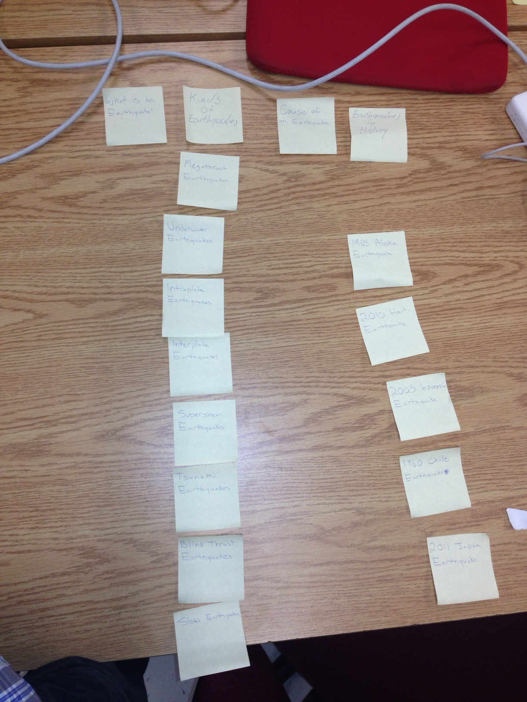
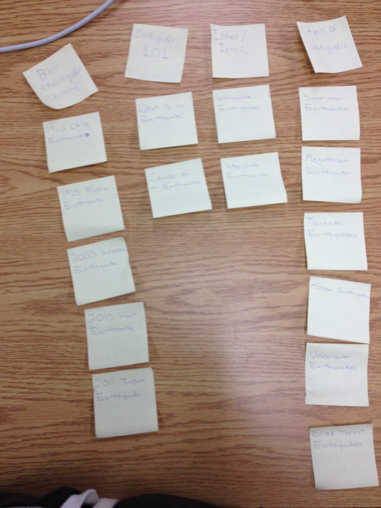

# Card sort report

The purpose of this card sort was to determine common navigation patterns and categories from the content of nick88999.github.io.

## Specifics

The card sort was conducted by Nick Appolon on September 12th, 2013 between the times of 3pm and 6pm with the following participants:

- Sylvia McCauley
- Alejandro Andrade

### Cards

15 cards were used covering a broad range of applicable content for the website. The following topics were used as cards:

1. 1960 Chile Earthquake
2. 1965 Alaska Earthquake
3. 2005 Indonesia Earthquake
4. 2010 Haiti Earthquake
5. 2011 Japan Earthquake
6. What is an Earthquake
7. Cause of an Earthquake
8. Intraplate Earthquakes
9. Interplate Earthquakes
10. Supershear Earthquake
11. Megathrust Earthquakes
12. Tsunami Earthquakes
13. Slow Earthquakes
14. Underwater Earthquakes
15. Blind Thrust Earthquakes

## Card sort results

*Card sort 1 by Alejandro Andrade*

*Card sort 2 by Sylvia McCauley*

## Observations

- The participants both thought that my cards were fairly easy to categorize. 
- They had no questions that stood out, they both just got to work with the categorizing and had a fairly easy time with it.
- Only slight struggle was with Sylvia when she thought that intraplate earthquakes and interplate earthquakes were in a category of their own, when in reality it is just a type of earthquake like supershear earthquakes, tsunami earthquakes, underwater earthquakes etc.
- They did not seem to find common grouping, so I feel like I made the card sort very clear to categorize.
- There did not seem to be any groupings that were unexpected
- The results were almost exactly as I expected, except for Sylvia's confusion with intraplate earthquakes and interplate earthquakes.
- I felt like I had done a pretty decent job at making the categories easy to sort since they had my card sorting completed fairly fast.